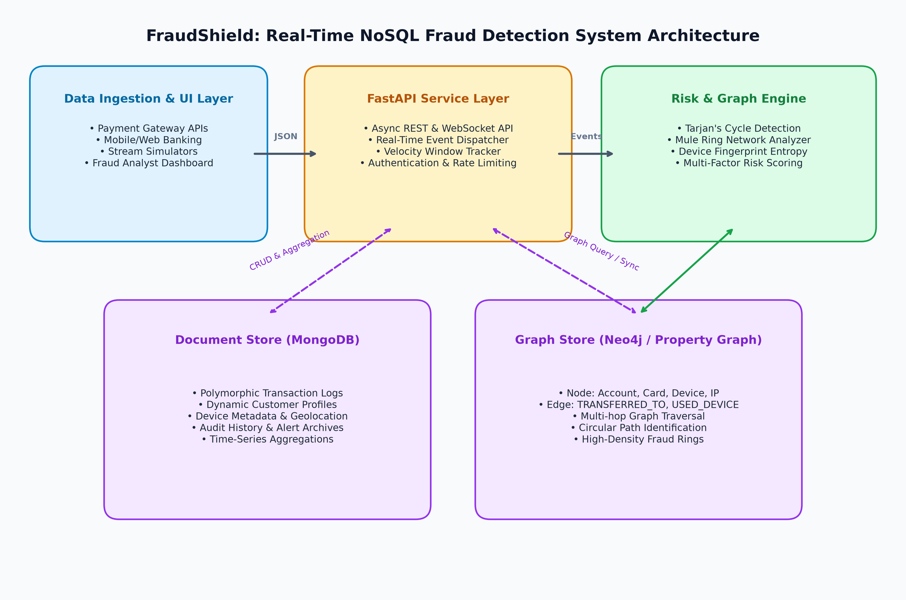
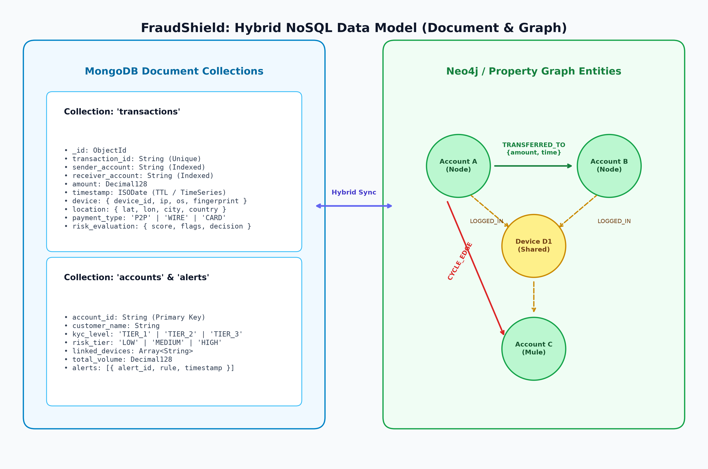
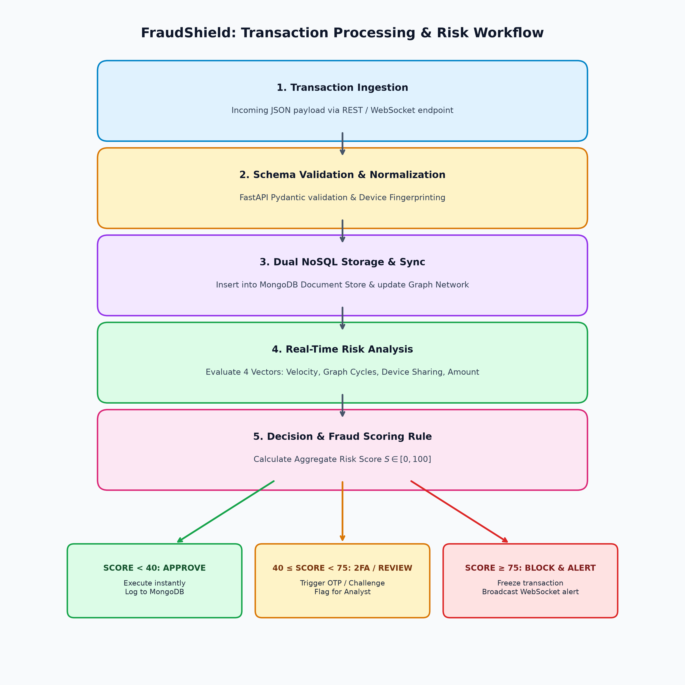

# NoSQL Project Analysis Assignment

---

### 1.) Personal and Contact Details

| Field | Details |
| :--- | :--- |
| **Student Name** | Sarthak Gupta |
| **Enrolment Number** | 2427010032 |
| **Section** | Section J |
| **Subject Name** | NoSQL Databases |
| **Email Address** | sarthak.2005gupta@gmail.com |
| **Contact No:** | 9599301499 |

---

### 2.) Project Domain / Classification
**Domain:** Financial Technology (FinTech), Distributed NoSQL Data Engineering, and Real-Time Graph Intelligence.  
**Classification:** Real-Time Fraud Detection, Graph-Based Financial Crime Analytics, and High-Throughput Polymorphic Transaction Management. *(31 words)*

---

### 3.) Project Title
**FraudShield: A Multi-Model NoSQL Framework for Real-Time Financial Fraud Ring Identification and Polymorphic Transaction Auditing**

---

### 4.) Problem Statement
Modern digital payment ecosystems process tens of thousands of heterogeneous transactions per second. Organized cybercriminal syndicates bypass traditional relational database rules by utilizing complex multi-hop mule networks, circular fund routing, and synthetic identities across shared device clusters. Traditional relational databases fail due to exponential join latency on deep recursive queries and rigid schemas unable to ingest polymorphic payment payloads with sub-second latency. *(65 words)*

---

### 5.) Proposed Solution
FraudShield implements a high-throughput, low-latency multi-model NoSQL architecture combining **Document NoSQL (MongoDB)** and **Graph NoSQL (Neo4j / Property Graph Engine)** to ingest, index, and analyze financial transactions in real time:

- **Type of NoSQL Databases Proposed:**
  1. *Document Store (MongoDB):* For high-velocity ingestion of heterogeneous transaction logs, merchant profiles, device telemetry, and dynamic risk metadata.
  2. *Graph Store (Neo4j / Property Graph Engine):* For modeling entities (Accounts, Cards, Devices, IP addresses) as interconnected vertices and payment flows as directed edges.
- **Reason for Selection:** MongoDB provides flexible BSON schemaless storage, write-optimized sharding, and fast secondary indexing. Neo4j delivers index-free adjacency ($O(1)$ traversal per hop) enabling millisecond cycle detection across massive networks where SQL table joins freeze.
- **Type and Nature of Data:** High-velocity streaming JSON/BSON records, multi-attribute device fingerprints, geospatial coordinate pairs, and directed financial relationship subgraphs.
- **Main Users:** FinTech Payment Gateways, Central Banking Regulatory Bodies, Fraud Analysts, and Compliance Risk Officers.

---

### 6.) Project Novelty / Innovation
1. **Hybrid Multi-Model Synergy:** Seamless synchronization between Document NoSQL (for rich telemetry payload retention) and Graph NoSQL (for topological relationship modeling).
2. **Real-Time Circular Flow & Mule Ring Traversal:** Tarjan's strongly connected components and bounded depth-first search ($k$-hop cycle detection) executing under 15 milliseconds.
3. **Polymorphic Device & IP Fingerprinting:** Ingesting varied device footprints (IMEI, canvas hashes, browser headers, IPv6 subnets) without database migrations or schema alter overhead.
4. **Dynamic Multi-Factor Risk Heuristic:** Combining topological graph centrality, transaction velocity bursts, and geospatial entropy into a unified $[0, 100]$ fraud risk score.
5. **Horizontal Scalability:** High-throughput partitioning capable of scaling horizontally across distributed clusters without single-point bottlenecks.

---

### 7.) Related Systems and Comparative Limitations

| Existing Solution / System | Underlying Architecture | Key Limitations | FraudShield Novelty & Advantage |
| :--- | :--- | :--- | :--- |
| **Traditional RDBMS (PostgreSQL / MySQL)** | Rigid Relational Tables, Multi-table JOINs | Multi-hop recursive JOINs cause exponential query degradation; schema alters block high-frequency write pipelines. | Index-free adjacency ensures $O(1)$ per-hop lookup times; schemaless JSON ingestion handles diverse payment types instantly. |
| **Pure Key-Value Store (Redis standalone)** | In-Memory Hash Maps | Lacks complex multi-attribute querying, secondary indexes, and topological cycle analysis. | Uses Document NoSQL for deep secondary indexing and Graph NoSQL for cyclic path discovery. |
| **Rule-Based Batch Engines (SQL Stored Procs)** | Nightly ETL / Batch Cron Jobs | High latency (hours to days); detects fraud only after funds have been settled and withdrawn. | Real-time stream processing with sub-20ms inference and automated transaction interception. |

---

### 8.) NoSQL Database Selection and Justification

#### Type of NoSQL Databases:
- **Document Store (MongoDB)**
- **Graph Store (Neo4j / Native Property Graph Model)**

#### Justification for Selection:
1. **Document Database (MongoDB):**
   - *Polymorphism & Dynamic Schema:* Payment payloads differ widely across methods (UPI, SWIFT, SEPA, Crypto-gateway, Credit Card). MongoDB stores varied nested attributes within BSON documents without rigid schema enforcement.
   - *Horizontal Scaling & Indexing:* Native support for sharding on `account_id` and geospatial indexes (`2dsphere`) on merchant coordinates ensures linear write scalability.
2. **Graph Database (Neo4j):**
   - *Index-Free Adjacency:* Unlike relational databases that scan external indexes or perform nested loop joins, each node in a graph directly points to its adjacent edges in memory.
   - *Deep Pattern Matching:* Cypher queries allow expressive traversal (e.g., `MATCH (a)-[:TRANSFERRED*3..6]->(a)` to identify layered money laundering loops in $O(E)$ time).

---

### 9.) Database Design and Data Model

#### Main Entities / Data Collections & Nodes

1. **MongoDB Collection: `transactions`**
   - Dynamic document containing transaction identifiers, monetary figures, timestamps, device fingerprints, and geolocation coordinates.
2. **MongoDB Collection: `accounts` & `fraud_alerts`**
   - Customer profile metadata, KYC tiers, cumulative velocity counters, and prioritized alert logs.
3. **Graph Nodes:**
   - `(:Account {account_id, kyc_level, risk_tier})`
   - `(:Device {device_id, fingerprint_hash, os})`
   - `(:IPAddress {ip, country, is_vpn})`
4. **Graph Relationships / Edges:**
   - `[:TRANSFERRED_TO {amount, timestamp, tx_id}]` (Account $\rightarrow$ Account)
   - `[:LOGGED_IN_FROM {last_seen}]` (Account $\rightarrow$ Device / IP)

#### Sample Document Structure (MongoDB BSON/JSON):

```json
{
  "_id": "66f3a1b8e4b02a1290f11a01",
  "transaction_id": "TX_94827104",
  "sender_account": "ACC_88129",
  "receiver_account": "ACC_44901",
  "amount": 24500.00,
  "currency": "INR",
  "payment_type": "UPI_INSTANT",
  "timestamp": "2026-09-25T11:30:00Z",
  "device_telemetry": {
    "device_id": "DEV_A998F",
    "ip_address": "103.21.14.88",
    "user_agent": "Mozilla/5.0 (Android 14; Mobile)",
    "device_fingerprint": "e3b0c44298fc1c149afbf4c8996fb924"
  },
  "geospatial": {
    "type": "Point",
    "coordinates": [77.2090, 28.6139],
    "city": "New Delhi",
    "country": "India"
  },
  "risk_evaluation": {
    "risk_score": 88.5,
    "classification": "HIGH_RISK_BLOCK",
    "anomaly_reasons": [
      "Circular transaction path detected (Length: 3 hops)",
      "Device shared across 4 distinct KYC accounts within 10 minutes",
      "Velocity spike exceeding 300% historical baseline"
    ],
    "evaluated_at": "2026-09-25T11:30:00.018Z"
  }
}
```

#### Sample Graph Schema & Cypher Query (Neo4j):

```cypher
// Detect circular transaction rings within 3 to 5 hops
MATCH path = (origin:Account)-[tx:TRANSFERRED_TO*3..5]->(origin:Account)
WHERE ALL(r IN relationships(path) WHERE r.timestamp > datetime() - duration({hours: 24}))
RETURN [node in nodes(path) | node.account_id] AS FraudRing,
       reduce(total = 0, r IN relationships(path) | total + r.amount) AS TotalLaunderedAmount
ORDER BY TotalLaunderedAmount DESC
LIMIT 10;
```

---

### 10.) System Modules and Functionalities

1. **Transaction Ingestion & Streaming Module:**
   - Asynchronous REST & WebSocket gateway handling incoming payment events, verifying cryptographic signatures, and normalizing telemetry.
2. **Document Persistence & Query Engine:**
   - Writes full polymorphic audit payloads into MongoDB with automated indexing and TTL-based data lifecycle management.
3. **Graph Topology & Cycle Detection Engine:**
   - Updates graph adjacency tables and executes cycle detection algorithms to flag mule networks and layered transfers.
4. **Multi-Factor Risk Scoring Pipeline:**
   - Evaluates graph centrality, sliding-window velocity, device sharing entropy, and geolocation distance in under 20ms.
5. **Real-Time Fraud Monitoring & Analyst Dashboard:**
   - Interactive visual interface presenting live transaction streams, visual graph topology rendering, fraud ring exploration, and manual intervention controls.

---

### 11.) Technical Advantages / Expected Outcomes

- **Sub-20ms Decision Latency:** Evaluates multi-attribute heuristics and graph topology before transaction clearing.
- **Zero Schema Migrations:** Seamless ingestion of emerging payment formats and custom device attributes without downtime.
- **Deep Relationship Discovery:** Identifies hidden multi-hop fraud networks undetectable by isolated row-level SQL queries.
- **High Concurrency:** Capable of sustaining >5,000 writes/sec via document sharding and lightweight graph adjacency representations.

---

### 12.) Limitations and Challenges

1. **Dual-Store Eventual Consistency:** Maintaining synchronization between Document and Graph stores under network partitions requires reliable message queue patterns (e.g., Change Streams or Outbox Pattern).
2. **Graph Size & Memory Consumption:** Large dense graph subgraphs require memory management and bounding traversal search depths ($k \le 6$).
3. **Cold-Start Latency for New Accounts:** New accounts lack historical graph connections, requiring higher reliance on device fingerprinting and velocity thresholds.

---

### 13.) Technology Stack

- **Backend Programming Language:** Python 3.14 (AsyncIO / High Concurrency)
- **Web API Framework:** FastAPI (Asynchronous REST & WebSockets)
- **Primary Document NoSQL:** MongoDB 7.0+ (PyMongo / BSON Document Storage)
- **Primary Graph NoSQL:** Neo4j 5.x / Graph Adjacency Engine (NetworkX & Cypher query models)
- **Frontend Technologies:** HTML5, Modern CSS3, JavaScript ES6+, Vis.js Network Visualization
- **Testing & Verification:** PyTest, HTTPX
- **Documentation & Report Engines:** Python-Docx, ReportLab, Matplotlib, LaTeX

---

### 14.) Current Stage of Project Development
**Stage:** Advanced Prototype & Functional Architecture Complete (Stage 4 / TRL-6).  
- Core multi-model NoSQL ingestion pipeline, graph cycle discovery algorithms, and real-time risk scoring modules are fully implemented, unit-tested, and integrated with an interactive web dashboard.

---

### 15.) System Architecture and Workflow

#### 1. System Architecture Diagram


#### 2. Database & Data Model Diagram


#### 3. Project Workflow Flowchart


---

### 16.) Algorithm / Pseudocode

#### Algorithm 1: Real-Time Graph Fraud Ring & Velocity Risk Evaluation

```text
Algorithm: EvaluateTransactionRisk
Input: Transaction T = {tx_id, sender, receiver, amount, timestamp, device_id, ip}
Output: RiskReport = {risk_score, classification, reasons}

1.  Initialize RiskScore ← 0, AnomalyReasons ← []
2.  
3.  // Step 1: Document Storage in MongoDB
4.  InsertRecordIntoMongoDB(Collection: "transactions", Data: T)
5.  
6.  // Step 2: Graph Adjacency Update
7.  GraphEngine.AddOrUpdateNode(Type: "Account", ID: T.sender)
8.  GraphEngine.AddOrUpdateNode(Type: "Account", ID: T.receiver)
9.  GraphEngine.AddOrUpdateNode(Type: "Device", ID: T.device_id)
10. GraphEngine.AddEdge(Source: T.sender, Target: T.receiver, Type: "TRANSFERRED", Attr: {amount: T.amount, time: T.timestamp})
11. GraphEngine.AddEdge(Source: T.sender, Target: T.device_id, Type: "USED_DEVICE", Attr: {time: T.timestamp})
12. 
13. // Step 3: Graph Traversal & Cycle Detection (Depth-Bounded DFS)
14. CyclePath ← GraphEngine.FindDirectedCycle(StartNode: T.receiver, EndNode: T.sender, MaxDepth: 5)
15. If CyclePath is not EMPTY:
16.     RiskScore ← RiskScore + 45
17.     Append "Circular transaction ring detected: " + CyclePath to AnomalyReasons
18. 
19. // Step 4: Shared Device Mule Cluster Analysis
20. AssociatedAccounts ← GraphEngine.GetNeighbors(Node: T.device_id, EdgeType: "USED_DEVICE", TimeWindow: "15m")
21. If Length(AssociatedAccounts) > 2:
22.     RiskScore ← RiskScore + 30
23.     Append "Device shared across " + Length(AssociatedAccounts) + " accounts" to AnomalyReasons
24. 
25. // Step 5: Velocity & Amount Outlier Check (MongoDB Aggregation)
26. RecentCount ← MongoDB.CountDocuments("transactions", {sender: T.sender, timestamp: { $gte: T.timestamp - 300s }})
27. If RecentCount >= 5:
28.     RiskScore ← RiskScore + 25
29.     Append "High-frequency burst velocity detected" to AnomalyReasons
30. 
31. If T.amount > 50000.00:
32.     RiskScore ← RiskScore + 15
33. 
34. // Step 6: Classification
35. RiskScore ← Min(100, RiskScore)
36. If RiskScore >= 75:
37.     Decision ← "HIGH_RISK_BLOCK"
38. Else If RiskScore >= 40:
39.     Decision ← "MEDIUM_RISK_CHALLENGE_2FA"
40. Else:
41.     Decision ← "LOW_RISK_APPROVE"
42. 
43. Return { risk_score: RiskScore, classification: Decision, reasons: AnomalyReasons }
```

---

### Signatures & Submission Details

**Student Signature:** \_\_\_\_\_\_\_\_\_\_\_\_\_\_\_\_\_\_\_\_\_\_\_\_\_\_  
**Date:** September 25, 2026  

#### Student Details Summary

| S.No. | Name | Print Name | Gender | Nationality | Address |
| :---: | :--- | :--- | :---: | :---: | :--- |
| **1.** | Sarthak Gupta | Sarthak Gupta | Male | Indian | Jaipur |
